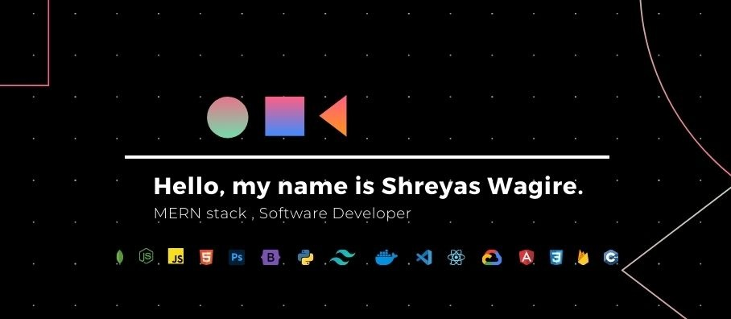

  

###

<h3>About Me | </h3>

  

    👨‍💻 I'm a passionate <a style="color: white; font-weight: bold; text-decoration: none;" href="https://github.com/shreyas-wagire">MERN stack developer</a> and 🤖 <a style="color: white; font-weight: bold; text-decoration: none;" href="#">AI/ML enthusiast</a>, building scalable web applications and innovative solutions. 
    🎓 Currently pursuing <a style="color: white; font-weight: bold; text-decoration: none;" href="https://www.adcet.ac.in/">Computer Science Engineering at ADCET</a>, I've worked on projects like 
    📚 <a style="color: white; font-weight: bold; text-decoration: none;" href="https://notecafe.vercel.app/">NoteCafe</a>, ✈️ <a style="color: white; font-weight: bold; text-decoration: none;" href="https://github.com/Shreyas-Wagire/WanderLust-Travling-Site">Wanderlust</a>, and 🌿 a 
    <a style="color: white; font-weight: bold; text-decoration: none;" href="#">Plant Disease Detection platform</a>. I actively contribute to 
    🌍 <a style="color: white; font-weight: bold; text-decoration: none;" href="https://devpost.com/">open source</a>, participate in 🏆 <a style="color: white; font-weight: bold; text-decoration: none;"href="#">hackathons</a>, and manage tech communities. 
    🚀 As a <a style="color: white; font-weight: bold; text-decoration: none;"href="https://gdg.community.dev/">Web Developer at GDG Cloud Club</a> and 
    🧑‍🏫 <a style="color: white; font-weight: bold; text-decoration: none;" href="#">Student Training Program Coordinator</a>, I love collaborating, learning, and creating impactful projects.
  

##

<h3>Contributions |</h3>
<picture>
  <source media="(prefers-color-scheme: dark)" srcset="https://raw.githubusercontent.com/tobiasmeyhoefer/tobiasmeyhoefer/output/github-snake-dark.svg" />
  <source media="(prefers-color-scheme: light)" srcset="https://raw.githubusercontent.com/tobiasmeyhoefer/tobiasmeyhoefer/output/github-snake.svg" />
  
</picture>

###
